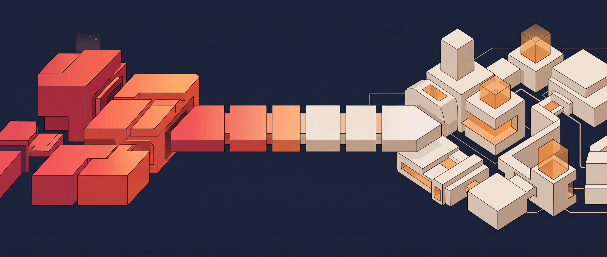

<p align="center">
  
</p>

# Capa Java AWS Adapters

AWS SPI modules for the [Capa Java SDK](https://github.com/capa-cloud/capa-java). Each module connects a specific Capa component surface to AWS SDK for Java v2 services.

[Documentation](https://capa.rxcloud.group/) · [Issues](https://github.com/capa-cloud/capa-java-aws/issues)

> This repository contains adapters, not a standalone application. Applications must include `capa-sdk` and only the adapter modules they use.

## Requirements and versions

- Java 8 or 11
- Maven 3.8.1 or later
- Capa Java `1.11.13.2.RELEASE`
- Capa AWS adapters `1.11.13.5.RELEASE`
- AWS credentials and IAM permissions for the selected services

There is no `group.rxcloud:capa-spi-aws:1.11.13.5.RELEASE` aggregate artifact. Depend on the individual modules below.

## Modules

| Artifact | AWS integration | Implemented surface |
| --- | --- | --- |
| `capa-spi-aws-mesh` | App Mesh-compatible service addressing | `AwsCapaHttp`, RPC options and serializer loading |
| `capa-spi-aws-config` | AWS AppConfig | `AwsCapaConfigStore`, polling and serialization |
| `capa-spi-aws-telemetry` | Amazon CloudWatch | Metric export and AWS trace-context propagation |
| `capa-spi-aws-log` | Amazon CloudWatch Logs | Log4j/Logback appenders and log delivery |
| `capa-spi-aws-infrastructure` | Shared Capa infrastructure | Common environment integration used by the other modules |

The table describes code present in this repository. It does not claim that AWS provisions service discovery, routing, mTLS, alarms, or X-Ray resources for the application. Configure those capabilities separately in AWS when required.

## Add an adapter

Choose only the modules required by the application. For example:

```xml
<properties>
    <capa.version>1.11.13.2.RELEASE</capa.version>
    <capa.aws.version>1.11.13.5.RELEASE</capa.aws.version>
</properties>

<dependencies>
    <dependency>
        <groupId>group.rxcloud</groupId>
        <artifactId>capa-sdk</artifactId>
        <version>${capa.version}</version>
    </dependency>

    <dependency>
        <groupId>group.rxcloud</groupId>
        <artifactId>capa-spi-aws-mesh</artifactId>
        <version>${capa.aws.version}</version>
        <scope>runtime</scope>
    </dependency>

    <dependency>
        <groupId>group.rxcloud</groupId>
        <artifactId>capa-spi-aws-config</artifactId>
        <version>${capa.aws.version}</version>
        <scope>runtime</scope>
    </dependency>
</dependencies>
```

Use `capa-spi-aws-telemetry` and `capa-spi-aws-log` in the same way when those integrations are needed.

Adapter classes are discovered through Capa component resource mappings. Do not instantiate internal SPI classes as application clients. The relevant defaults and mapping files are:

- [Mesh RPC settings](capa-spi-aws-mesh/src/main/resources/capa-component-rpc-aws.properties)
- [AppConfig settings](capa-spi-aws-config/src/main/resources/capa-component-configuration-aws.properties)
- [Telemetry settings](capa-spi-aws-telemetry/src/main/resources/capa-component-telemetry-aws.properties)
- [Log component mapping](capa-spi-aws-log/src/main/resources/capa-component-log.properties)

Copy environment-specific values into the application's configuration. Do not modify and publish credentials in these resource files.

## AWS credentials

AWS clients use the AWS SDK default credential and Region resolution behavior. Prefer short-lived credentials supplied by the workload environment, such as an ECS task role or EC2 instance profile. Local development can use environment variables or an AWS shared configuration profile.

Never commit `AWS_ACCESS_KEY_ID`, `AWS_SECRET_ACCESS_KEY`, session tokens, account identifiers, or private endpoints to this repository.

## Repository layout

```text
.
├── capa-spi-aws-mesh/
├── capa-spi-aws-config/
├── capa-spi-aws-telemetry/
├── capa-spi-aws-log/
├── capa-spi-aws-infrastructure/
├── example/                       # Current logging example
└── pom.xml
```

The current [`example/`](example/) module demonstrates the logging integration. Treat module tests as implementation examples for configuration, mesh, and telemetry until dedicated runnable samples are added.

## Build and verify

```bash
git clone https://github.com/capa-cloud/capa-java-aws.git
cd capa-java-aws
mvn --batch-mode --no-transfer-progress --fail-fast clean verify \
  -Pjacoco,rat,checkstyle \
  -DskipTests=false \
  -Dcheckstyle.skip=false \
  -Drat.skip=false \
  -Dmaven.javadoc.skip=true \
  -Dgpg.skip=true
```

CI runs this command on Java 8 and Java 11. Tests mock or isolate AWS calls where possible; production readiness still requires integration tests with the target IAM policies, Region, network, and AWS resources.

## Contributing

1. Create a branch from `master`.
2. Keep adapter behavior compatible with Capa Java `1.11.13.2.RELEASE`.
3. Add mocked tests for adapter behavior and integration tests for changes that depend on AWS responses.
4. Update resource examples and this README when configuration keys or artifacts change.
5. Run the full verification command above before opening a pull request.

The repository enforces Apache RAT and Checkstyle. It does not currently configure Google Java Format or SpotBugs.

## License

Apache License 2.0. See [LICENSE](LICENSE).
