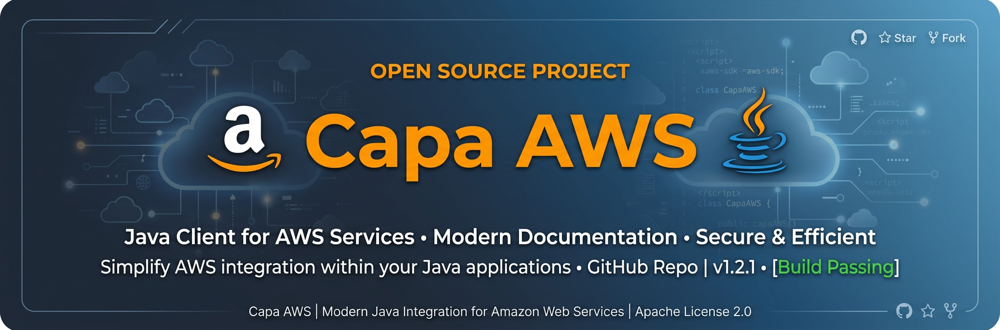
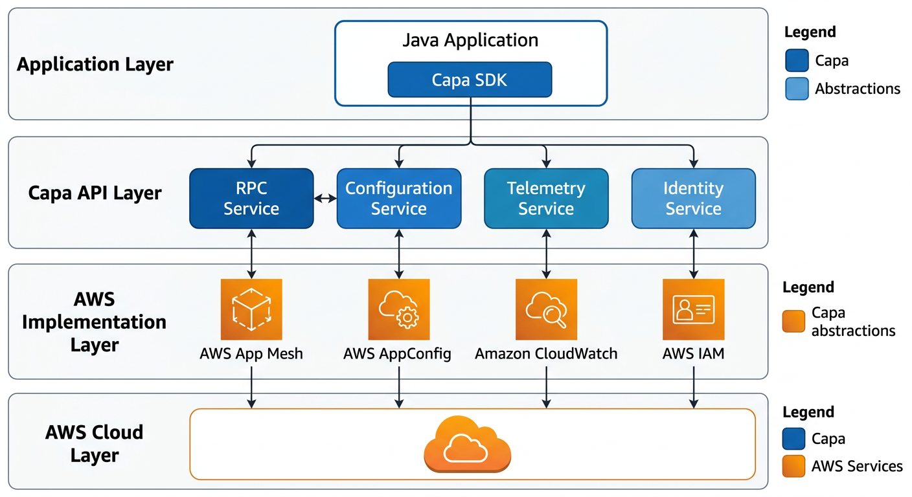
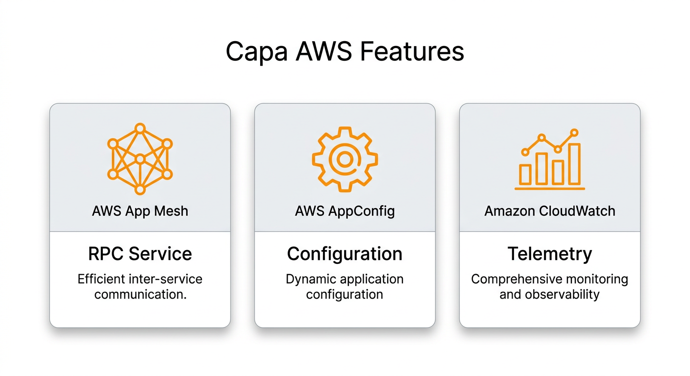

<p align="center">
  
</p>

<h1 align="center">Capa AWS</h1>

<p align="center">
  <strong>AWS Cloud Services Implementation for Capa Java SDK</strong>
</p>

<p align="center">
  <a href="https://github.com/capa-cloud/capa-java">Capa Java</a> ·
  <a href="https://aws.amazon.com/">AWS</a>
</p>

<p align="center">
  
  
  
  
</p>

---

## 📖 Introduction

**Capa AWS** provides AWS cloud service implementations for the [Capa Java SDK](https://github.com/capa-cloud/capa-java), enabling Java applications to leverage AWS managed services through Capa's standardized APIs.

This project implements Capa's SPI (Service Provider Interface) for AWS services, allowing seamless integration of AWS capabilities into your Java applications with minimal configuration changes.

### Supported AWS Services

| AWS Service | Capa Feature | Status |
|-------------|--------------|--------|
| AWS App Mesh | RPC Service | ✅ Stable |
| AWS AppConfig | Configuration | ✅ Stable |
| AWS CloudWatch | Telemetry | ✅ Stable |

---

## 🏗️ Architecture

<p align="center">
  
</p>

### Module Structure

```
capa-java-aws/
├── capa-spi-aws-mesh/           # AWS App Mesh implementation for RPC
├── capa-spi-aws-config/         # AWS AppConfig implementation
├── capa-spi-aws-telemetry/      # AWS CloudWatch for metrics/logs
├── capa-spi-aws-log/            # AWS CloudWatch Logs
├── capa-spi-aws-infrastructure/ # Common AWS infrastructure utilities
├── example/                     # Usage examples
└── pom.xml                      # Maven parent POM
```

**Key Design Principles:**
- **Standard API**: Implements Capa's vendor-neutral interfaces
- **AWS Native**: Leverages AWS SDK best practices
- **Pluggable**: Easy to swap with other cloud implementations
- **Production Ready**: Battle-tested with enterprise workloads

---

## ✨ Features

<p align="center">
  
</p>

### RPC Service (AWS App Mesh)

| Feature | Description | Status |
|---------|-------------|--------|
| Service Discovery | Automatic service registration and discovery | ✅ Stable |
| Load Balancing | Client-side load balancing | ✅ Stable |
| Traffic Management | Advanced routing and traffic splitting | ✅ Stable |
| mTLS | Mutual TLS for secure communication | ✅ Stable |

### Configuration (AWS AppConfig)

| Feature | Description | Status |
|---------|-------------|--------|
| Dynamic Config | Runtime configuration updates | ✅ Stable |
| Feature Flags | Toggle features without deployment | ✅ Stable |
| Safe Rollouts | Gradual configuration rollouts | ✅ Stable |
| Validation | Automatic configuration validation | ✅ Stable |

### Telemetry (AWS CloudWatch)

| Feature | Description | Status |
|---------|-------------|--------|
| Metrics | Custom metrics and dashboards | ✅ Stable |
| Logs | Centralized log aggregation | ✅ Stable |
| Alarms | Automated alerting | ✅ Stable |
| Traces | Distributed tracing with X-Ray | 🔬 Beta |

---

## 🚀 Getting Started

### Prerequisites

- Java 8 or higher
- AWS Account with appropriate permissions
- AWS CLI configured (optional but recommended)

### Maven Dependency

```xml
<dependency>
    <groupId>group.rxcloud</groupId>
    <artifactId>capa-spi-aws</artifactId>
    <version>1.0.7.RELEASE</version>
</dependency>
```

Or include specific modules:

```xml
<!-- RPC with AWS App Mesh -->
<dependency>
    <groupId>group.rxcloud</groupId>
    <artifactId>capa-spi-aws-mesh</artifactId>
    <version>1.0.7.RELEASE</version>
</dependency>

<!-- Configuration with AWS AppConfig -->
<dependency>
    <groupId>group.rxcloud</groupId>
    <artifactId>capa-spi-aws-config</artifactId>
    <version>1.0.7.RELEASE</version>
</dependency>

<!-- Telemetry with AWS CloudWatch -->
<dependency>
    <groupId>group.rxcloud</groupId>
    <artifactId>capa-spi-aws-telemetry</artifactId>
    <version>1.0.7.RELEASE</version>
</dependency>
```

### Quick Start

#### 1. RPC Service (AWS App Mesh)

```java
import group.rxcloud.capa.spi.aws.mesh.AwsCapaRpcService;

// Initialize the AWS RPC service
AwsCapaRpcService rpcService = new AwsCapaRpcService();

// Invoke a remote service
byte[] response = rpcService.invokeMethod(
    "service-name",
    "method-name",
    requestData
);
```

#### 2. Configuration (AWS AppConfig)

```java
import group.rxcloud.capa.spi.aws.config.AwsCapaConfigurationService;

// Initialize the AWS Configuration service
AwsCapaConfigurationService configService = new AwsCapaConfigurationService();

// Get configuration values
Map<String, String> config = configService.getConfiguration(
    "appconfig-store",
    Arrays.asList("key1", "key2")
);

// Subscribe to configuration changes
ConfigurationSubscription subscription = configService.subscribeConfiguration(
    "appconfig-store",
    Arrays.asList("key1")
);
```

#### 3. Telemetry (AWS CloudWatch)

```java
import group.rxcloud.capa.spi.aws.telemetry.AwsCapaTelemetryService;

// Initialize the AWS Telemetry service
AwsCapaTelemetryService telemetryService = new AwsCapaTelemetryService();

// Record custom metrics
telemetryService.recordMetric(
    "CustomMetricName",
    1.0,
    MetricUnit.Count,
    tags
);

// Log events
telemetryService.logEvent(
    LogLevel.INFO,
    "Application started successfully",
    context
);
```

---

## ⚙️ Configuration

### AWS Credentials

Capa AWS uses the standard AWS credentials chain:

1. Environment variables (`AWS_ACCESS_KEY_ID`, `AWS_SECRET_ACCESS_KEY`)
2. Java system properties
3. AWS credentials file (`~/.aws/credentials`)
4. ECS container credentials
5. EC2 instance profile

### Application Configuration

```yaml
# application.yml
capa:
  aws:
    region: us-east-1
    mesh:
      virtual-node: my-virtual-node
      namespace: my-namespace
    config:
      application: my-app
      environment: production
      configuration-profile: default
    telemetry:
      namespace: MyApplication/Metrics
      log-group: /aws/application/my-app
```

---

## 📚 Examples

See the [example](./example) directory for complete working examples:

- **Mesh Example**: Service-to-service communication with App Mesh
- **Config Example**: Dynamic configuration with AppConfig
- **Telemetry Example**: Metrics and logging with CloudWatch

---

## 🌐 Ecosystem

Capa AWS is part of the broader Capa Cloud ecosystem:

| Project | Description |
|---------|-------------|
| [capa-java](https://github.com/capa-cloud/capa-java) | Core Capa Java SDK |
| [capa-java-alibaba](https://github.com/capa-cloud/capa-java-alibaba) | Alibaba Cloud implementation |
| [cloud-runtimes-jvm](https://github.com/capa-cloud/cloud-runtimes-jvm) | JVM API specification |

---

## 🤝 Contributing

We welcome contributions from the community!

1. Fork the repository
2. Create your feature branch (`git checkout -b feature/amazing-feature`)
3. Commit your changes (`git commit -m 'Add amazing feature'`)
4. Push to the branch (`git push origin feature/amazing-feature`)
5. Open a Pull Request

### Development Setup

```bash
# Clone the repository
git clone https://github.com/capa-cloud/capa-java-aws.git
cd capa-java-aws

# Build with Maven
mvn clean install

# Run tests
mvn test

# Package
mvn package -DskipTests
```

### Code Style

This project follows standard Java conventions:

- Google Java Format
- Checkstyle validation
- SpotBugs static analysis

---

## 📜 License

This project is licensed under the Apache License 2.0 - see the [LICENSE](LICENSE) file for details.

---

<p align="center">
  <strong>Building portable cloud-native applications on AWS</strong>
</p>

<p align="center">
  <a href="https://github.com/capa-cloud">Capa Cloud</a> ·
  <a href="https://capa.rxcloud.group/">Documentation</a> ·
  <a href="https://aws.amazon.com/">AWS</a>
</p>
